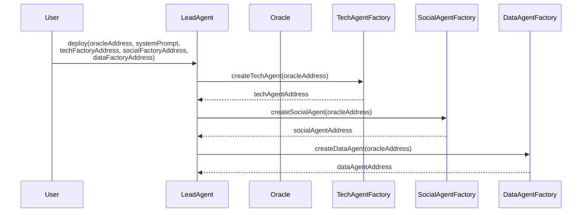
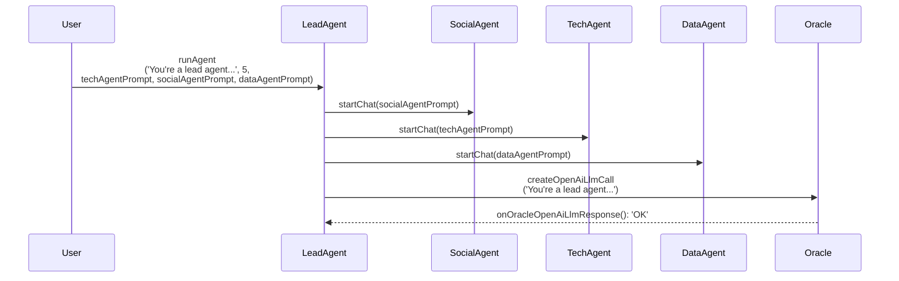
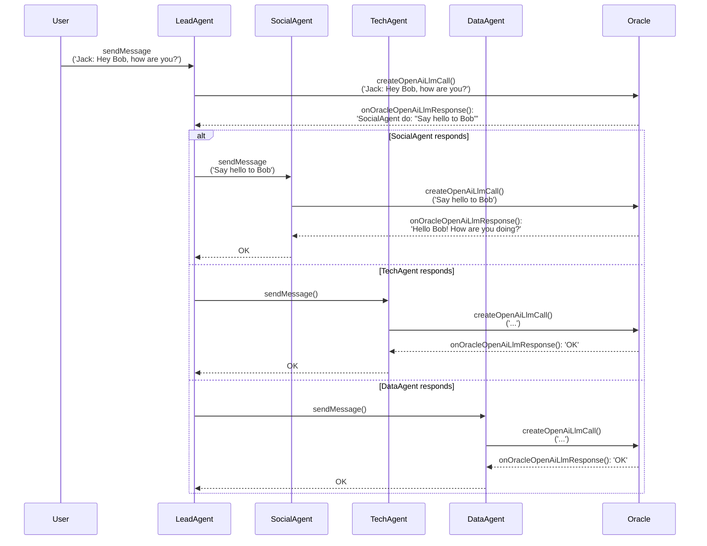

# Smart Contracts Overview

This README provides an overview of the smart contracts used in the project, which implements an AI-powered agent system on the Ethereum blockchain.

## Interaction

### Deployment

This diagram illustrates the deployment process of the LeadAgent contract and its interaction with the factory contracts to create specialized agents. It shows:
1. The User deploying the LeadAgent with necessary parameters.
2. The LeadAgent using TechAgentFactory, SocialAgentFactory, and DataAgentFactory to create respective specialized agents.
3. Each factory returning the address of the newly created agent to the LeadAgent.

### Initialization

This diagram depicts the initialization process of the LeadAgent and specialized agents. It demonstrates:
1. The User initiating the agent run with prompts for each agent type.
2. The LeadAgent starting chats with each specialized agent (Tech, Social, and Data) using their respective prompts.
3. The LeadAgent making an initial call to the Oracle with its own prompt.
4. The Oracle responding to confirm the initialization.

### Usage

This diagram showcases the typical usage flow of the system, including:
1. A User sending a message to the LeadAgent.
2. The LeadAgent forwarding the message to the Oracle for processing.
3. The Oracle responding with a directive for a specific agent to act.
4. The diagram then branches into three possible scenarios, showing how each specialized agent (Social, Tech, or Data) might respond:
    - Each scenario involves the specialized agent communicating with the Oracle and then responding back to the LeadAgent.

## Core Contracts

### LeadAgent

The `LeadAgent` contract is the central component of the system, managing agent runs and coordinating interactions between specialized agents.

**Key features:**

- Manages agent runs with multiple iterations
- Interacts with `TechAgent`, `SocialAgent`, and `DataAgent`
- Handles responses from the oracle for LLM calls and function calls
- Allows users to start new agent runs and add messages to existing runs

### EnhancedAnthropicChatGpt

This contract implements a chat interface using the Anthropic AI model, designed to handle chat interactions and function calls through an oracle.

**Key features:**

- Manages chat runs with message history
- Interacts with the oracle for LLM calls and function calls
- Supports a knowledge base query system
- Implements a whitelist system for access control

### EnhancedOpenAiChatGpt

Similar to the Anthropic version, this contract implements a chat interface using the OpenAI model.

**Key features:**

- Manages chat runs with message history
- Interacts with the oracle for OpenAI LLM calls and function calls
- Implements a whitelist system for access control

## Specialized Agent Contracts

### TechAgent, SocialAgent, DataAgent

These contracts extend the `BaseAgent` contract, which in turn extends the `EnhancedAnthropicChatGpt` contract. They are specialized versions of the chat agent for different domains.

## Factory Contracts

### TechAgentFactory, SocialAgentFactory, DataAgentFactory

These factory contracts are responsible for creating instances of the specialized agent contracts.

## Interfaces

The project includes several interface contracts (`IChatGpt`, `IOracle`, `IOpenAiChatGpt`) that define the structure for interactions between the main contracts and the oracle service.

## Usage

To use these contracts:

1. Deploy the factory contracts (`TechAgentFactory`, `SocialAgentFactory`, `DataAgentFactory`).
2. Deploy the `LeadAgent` contract, passing the addresses of the factory contracts and the oracle.
3. Interact with the `LeadAgent` contract to start new agent runs and manage interactions.

**Note:** These contracts rely heavily on an external oracle service for AI model interactions. Ensure that the oracle is properly set up and accessible before deploying and using these contracts.

## Security Considerations

- The contracts implement access control mechanisms, including owner-only functions and whitelisting.
- Ensure that the oracle address is set correctly and that only trusted addresses are whitelisted.
- Review and audit the contracts thoroughl
